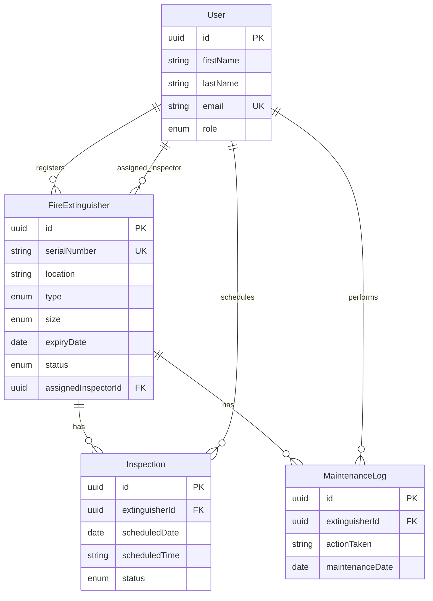

# Entity Relationship Diagram — TZW LTD

## Users (auth-service)

```
User
├── id (PK, UUID)
├── firstName
├── lastName
├── email (unique)
├── password (hashed)
├── role (ADMIN | INSPECTOR | USER)
├── isVerified
├── otp / otpExpiry
├── resetToken / resetExpiry
└── timestamps
```

## Fire Safety Domain (extinguisher-service)

```
FireExtinguisher                    Inspection
├── id (PK)                         ├── id (PK)
├── serialNumber (unique)           ├── extinguisherId (FK) ──► FireExtinguisher
├── location                        ├── scheduledDate
├── type (WATER|CO2|FOAM|...)       ├── scheduledTime
├── size (LB_1_5|LB_5|...)          ├── status (PENDING|COMPLETED|OVERDUE|...)
├── installationDate                ├── scheduledBy (userId ref)
├── expiryDate                      └── notes, notified
├── status
├── registeredBy (userId ref)
└── assignedInspectorId (FK, optional) ──► User (INSPECTOR)

MaintenanceLog
├── id (PK)
├── extinguisherId (FK) ──► FireExtinguisher
├── actionTaken
├── maintenanceDate
├── issuesIdentified
├── notes
└── performedBy (userId ref)
```

## Relationships

- One **FireExtinguisher** → many **Inspections**
- One **FireExtinguisher** → many **MaintenanceLogs**
- One **User** (INSPECTOR) → many **FireExtinguishers** (assigned field work)
- **User** IDs referenced across services (shared PostgreSQL database)

## Mermaid ERD


